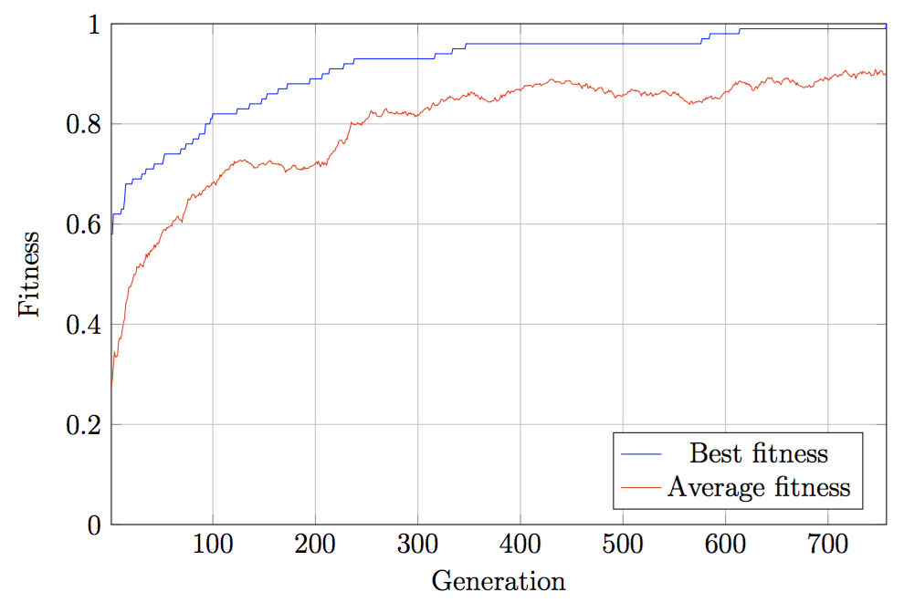

# Revolver Example: MAX-ONE
This is a minimal usage example of Revolver.

## The MAX-ONE Problem
The problem statement is very simple and straightforward:
> Given all bit strings of length between 10 and 100 characters, find a string which maximizes the number of ones.

Clearly, the solution is a string of 100 ones. This example shows, how evolutionary algorithms can be used to iteratively arrive at this conclusion.


## Credits
The example code was created by [Petr Mánek](https://github.com/petrmanek), Charles University, 2016.

This example is distributed under the [MIT License](https://en.wikipedia.org/wiki/MIT_License).

## Dependencies

 - Revolver
 - Xcode 7.3
 - Mac OS 10.11 El Capitan *(perhaps this example can be ported to Linux?)*

## Usage

 1. Build and run the project in Xcode. *(don't use xcodeproj in this directory, use xcworkspace in the parent directory)*
 2. Hit the *Run algorithm* button.
 3. Observe the output generated in the log.
 4. Play around with `Configuration.swift` to change the weights and values of things and observe how the output changes.
 5. Change parameters of the algorithm in `ViewController.swift` and observe how the output changes.

## Example Ouptut
When running this example, you should see similar output (provided that you don't change the seed or the configuration).



```
---
Run started.
Generation 1:		best: 0.58,		mean: 0.27515
Generation 2:		best: 0.58,		mean: 0.28955223880597
Generation 3:		best: 0.62,		mean: 0.3181
Generation 4:		best: 0.62,		mean: 0.3431
Generation 5:		best: 0.62,		mean: 0.33515
Generation 6:		best: 0.62,		mean: 0.33475
Generation 7:		best: 0.62,		mean: 0.3375
Generation 8:		best: 0.62,		mean: 0.363781094527363
Generation 9:		best: 0.62,		mean: 0.37165
Generation 10:		best: 0.62,		mean: 0.37089552238806
Generation 11:		best: 0.63,		mean: 0.37855
Generation 12:		best: 0.63,		mean: 0.3941
Generation 13:		best: 0.63,		mean: 0.40405
Generation 14:		best: 0.65,		mean: 0.4119
Generation 15:		best: 0.68,		mean: 0.44044776119403
Generation 16:		best: 0.68,		mean: 0.4466
Generation 17:		best: 0.68,		mean: 0.4563
Generation 18:		best: 0.68,		mean: 0.472885572139304
Generation 19:		best: 0.68,		mean: 0.47485
Generation 20:		best: 0.68,		mean: 0.47535
Generation 21:		best: 0.68,		mean: 0.48265
Generation 22:		best: 0.69,		mean: 0.48895
Generation 23:		best: 0.69,		mean: 0.499154228855722
Generation 24:		best: 0.69,		mean: 0.4991
Generation 25:		best: 0.69,		mean: 0.501840796019901
Generation 26:		best: 0.69,		mean: 0.51495
Generation 27:		best: 0.69,		mean: 0.513233830845771
Generation 28:		best: 0.69,		mean: 0.513731343283582
Generation 29:		best: 0.69,		mean: 0.5205
Generation 30:		best: 0.69,		mean: 0.5185
Generation 31:		best: 0.7,		mean: 0.51615
Generation 32:		best: 0.7,		mean: 0.514925373134329
Generation 33:		best: 0.7,		mean: 0.525373134328359
Generation 34:		best: 0.7,		mean: 0.5281
Generation 35:		best: 0.71,		mean: 0.538706467661692
Generation 36:		best: 0.71,		mean: 0.5337
Generation 37:		best: 0.71,		mean: 0.54155
Generation 38:		best: 0.71,		mean: 0.5383
Generation 39:		best: 0.71,		mean: 0.546567164179104
Generation 40:		best: 0.71,		mean: 0.545820895522388
Generation 41:		best: 0.71,		mean: 0.550049751243781
Generation 42:		best: 0.71,		mean: 0.55075
Generation 43:		best: 0.72,		mean: 0.5582
Generation 44:		best: 0.72,		mean: 0.55345
Generation 45:		best: 0.72,		mean: 0.559054726368159
Generation 46:		best: 0.72,		mean: 0.5619
Generation 47:		best: 0.72,		mean: 0.56105
Generation 48:		best: 0.72,		mean: 0.5673
Generation 49:		best: 0.72,		mean: 0.574328358208955
Generation 50:		best: 0.72,		mean: 0.57955223880597
Generation 51:		best: 0.72,		mean: 0.585
Generation 52:		best: 0.73,		mean: 0.5882
Generation 53:		best: 0.74,		mean: 0.58925
Generation 54:		best: 0.74,		mean: 0.5874
Generation 55:		best: 0.74,		mean: 0.593099999999999
Generation 56:		best: 0.74,		mean: 0.59205
Generation 57:		best: 0.74,		mean: 0.59405
Generation 58:		best: 0.74,		mean: 0.595124378109452
Generation 59:		best: 0.74,		mean: 0.59735
Generation 60:		best: 0.74,		mean: 0.596
Generation 61:		best: 0.74,		mean: 0.60505
Generation 62:		best: 0.74,		mean: 0.607213930348259
Generation 63:		best: 0.74,		mean: 0.6072
Generation 64:		best: 0.74,		mean: 0.6095
Generation 65:		best: 0.74,		mean: 0.6139
Generation 66:		best: 0.74,		mean: 0.615422885572139
Generation 67:		best: 0.74,		mean: 0.610799999999999
Generation 68:		best: 0.74,		mean: 0.60805
Generation 69:		best: 0.75,		mean: 0.608
Generation 70:		best: 0.75,		mean: 0.60395
Generation 71:		best: 0.75,		mean: 0.618706467661692
Generation 72:		best: 0.75,		mean: 0.62035
Generation 73:		best: 0.75,		mean: 0.6263
Generation 74:		best: 0.76,		mean: 0.6334
Generation 75:		best: 0.76,		mean: 0.639751243781095
Generation 76:		best: 0.76,		mean: 0.6502
Generation 77:		best: 0.76,		mean: 0.648208955223881
Generation 78:		best: 0.76,		mean: 0.6492
Generation 79:		best: 0.76,		mean: 0.6547
Generation 80:		best: 0.76,		mean: 0.6591
Generation 81:		best: 0.77,		mean: 0.6585
Generation 82:		best: 0.77,		mean: 0.6579
Generation 83:		best: 0.77,		mean: 0.65245
Generation 84:		best: 0.77,		mean: 0.655
Generation 85:		best: 0.77,		mean: 0.657213930348259
Generation 86:		best: 0.77,		mean: 0.657150000000001
Generation 87:		best: 0.78,		mean: 0.662089552238806
Generation 88:		best: 0.78,		mean: 0.65795
Generation 89:		best: 0.78,		mean: 0.65925
Generation 90:		best: 0.78,		mean: 0.66545
Generation 91:		best: 0.78,		mean: 0.66795
Generation 92:		best: 0.78,		mean: 0.6677
Generation 93:		best: 0.8,		mean: 0.6726
Generation 94:		best: 0.8,		mean: 0.675522388059702
Generation 95:		best: 0.8,		mean: 0.676417910447761
Generation 96:		best: 0.8,		mean: 0.673582089552239
Generation 97:		best: 0.8,		mean: 0.6762
Generation 98:		best: 0.81,		mean: 0.67635
Generation 99:		best: 0.81,		mean: 0.68185
Generation 100:		best: 0.82,		mean: 0.681592039800995
Generation 101:		best: 0.82,		mean: 0.6844
Generation 102:		best: 0.82,		mean: 0.68175
Generation 103:		best: 0.82,		mean: 0.6782
Generation 104:		best: 0.82,		mean: 0.68545
Generation 105:		best: 0.82,		mean: 0.68825
Generation 106:		best: 0.82,		mean: 0.68955
Generation 107:		best: 0.82,		mean: 0.698109452736319
Generation 108:		best: 0.82,		mean: 0.694899999999999
Generation 109:		best: 0.82,		mean: 0.69855
Generation 110:		best: 0.82,		mean: 0.7016
Generation 111:		best: 0.82,		mean: 0.702437810945273
Generation 112:		best: 0.82,		mean: 0.7071
Generation 113:		best: 0.82,		mean: 0.707910447761194
Generation 114:		best: 0.82,		mean: 0.7094
Generation 115:		best: 0.82,		mean: 0.7082
Generation 116:		best: 0.82,		mean: 0.709800000000001
Generation 117:		best: 0.82,		mean: 0.7162
Generation 118:		best: 0.82,		mean: 0.7188
Generation 119:		best: 0.82,		mean: 0.7194
Generation 120:		best: 0.82,		mean: 0.717014925373134
Generation 121:		best: 0.82,		mean: 0.72465
Generation 122:		best: 0.82,		mean: 0.721999999999999
Generation 123:		best: 0.82,		mean: 0.723283582089552
Generation 124:		best: 0.83,		mean: 0.72345
Generation 125:		best: 0.83,		mean: 0.7258
Generation 126:		best: 0.83,		mean: 0.727
Generation 127:		best: 0.83,		mean: 0.7276
Generation 128:		best: 0.83,		mean: 0.7254
Generation 129:		best: 0.83,		mean: 0.72585
Generation 130:		best: 0.83,		mean: 0.727
Generation 131:		best: 0.83,		mean: 0.728557213930348
Generation 132:		best: 0.83,		mean: 0.72675
Generation 133:		best: 0.83,		mean: 0.723899999999999
Generation 134:		best: 0.83,		mean: 0.7248
Generation 135:		best: 0.83,		mean: 0.7221
Generation 136:		best: 0.84,		mean: 0.72065
Generation 137:		best: 0.84,		mean: 0.72135
Generation 138:		best: 0.84,		mean: 0.7181
Generation 139:		best: 0.84,		mean: 0.7172
Generation 140:		best: 0.84,		mean: 0.711741293532338
Generation 141:		best: 0.84,		mean: 0.712950000000001
Generation 142:		best: 0.84,		mean: 0.7125
Generation 143:		best: 0.84,		mean: 0.71265
Generation 144:		best: 0.84,		mean: 0.71425
Generation 145:		best: 0.84,		mean: 0.718599999999999
Generation 146:		best: 0.84,		mean: 0.718849999999999
Generation 147:		best: 0.84,		mean: 0.7199
Generation 148:		best: 0.85,		mean: 0.72095
Generation 149:		best: 0.85,		mean: 0.7219
Generation 150:		best: 0.85,		mean: 0.7194
Generation 151:		best: 0.85,		mean: 0.71815
Generation 152:		best: 0.85,		mean: 0.71875
Generation 153:		best: 0.86,		mean: 0.722349999999999
Generation 154:		best: 0.86,		mean: 0.7236
Generation 155:		best: 0.86,		mean: 0.72565
Generation 156:		best: 0.86,		mean: 0.7269
Generation 157:		best: 0.86,		mean: 0.7236
Generation 158:		best: 0.86,		mean: 0.7206
Generation 159:		best: 0.86,		mean: 0.72125
Generation 160:		best: 0.86,		mean: 0.71985
Generation 161:		best: 0.86,		mean: 0.7205
Generation 162:		best: 0.86,		mean: 0.7197
Generation 163:		best: 0.86,		mean: 0.7195
Generation 164:		best: 0.87,		mean: 0.72075
Generation 165:		best: 0.87,		mean: 0.71755
Generation 166:		best: 0.87,		mean: 0.71925
Generation 167:		best: 0.87,		mean: 0.71745
Generation 168:		best: 0.87,		mean: 0.7153
Generation 169:		best: 0.87,		mean: 0.71385
Generation 170:		best: 0.87,		mean: 0.7087
Generation 171:		best: 0.87,		mean: 0.70355
Generation 172:		best: 0.87,		mean: 0.7074
Generation 173:		best: 0.88,		mean: 0.706815920398009
Generation 174:		best: 0.88,		mean: 0.70995
Generation 175:		best: 0.88,		mean: 0.70985
Generation 176:		best: 0.88,		mean: 0.711
Generation 177:		best: 0.88,		mean: 0.7138
Generation 178:		best: 0.88,		mean: 0.717399999999999
Generation 179:		best: 0.88,		mean: 0.715771144278607
Generation 180:		best: 0.88,		mean: 0.717249999999999
Generation 181:		best: 0.88,		mean: 0.71405
Generation 182:		best: 0.88,		mean: 0.71035
Generation 183:		best: 0.88,		mean: 0.7092
Generation 184:		best: 0.88,		mean: 0.70995
Generation 185:		best: 0.88,		mean: 0.70915
Generation 186:		best: 0.88,		mean: 0.7078
Generation 187:		best: 0.88,		mean: 0.710845771144278
Generation 188:		best: 0.88,		mean: 0.7089
Generation 189:		best: 0.88,		mean: 0.7137
Generation 190:		best: 0.88,		mean: 0.710199004975124
Generation 191:		best: 0.88,		mean: 0.711
Generation 192:		best: 0.88,		mean: 0.71155
Generation 193:		best: 0.88,		mean: 0.71085
Generation 194:		best: 0.88,		mean: 0.71385
Generation 195:		best: 0.89,		mean: 0.7153
Generation 196:		best: 0.89,		mean: 0.7157
Generation 197:		best: 0.89,		mean: 0.715820895522388
Generation 198:		best: 0.89,		mean: 0.71745
Generation 199:		best: 0.89,		mean: 0.71845
Generation 200:		best: 0.89,		mean: 0.72085
Generation 201:		best: 0.89,		mean: 0.7236
Generation 202:		best: 0.89,		mean: 0.720497512437811
Generation 203:		best: 0.89,		mean: 0.7252
Generation 204:		best: 0.89,		mean: 0.71855
Generation 205:		best: 0.89,		mean: 0.7148
Generation 206:		best: 0.89,		mean: 0.71985
Generation 207:		best: 0.9,		mean: 0.7233
Generation 208:		best: 0.9,		mean: 0.71865
Generation 209:		best: 0.9,		mean: 0.72205
Generation 210:		best: 0.9,		mean: 0.72075
Generation 211:		best: 0.9,		mean: 0.71785
Generation 212:		best: 0.9,		mean: 0.7295
Generation 213:		best: 0.9,		mean: 0.7298
Generation 214:		best: 0.91,		mean: 0.73615
Generation 215:		best: 0.91,		mean: 0.73925
Generation 216:		best: 0.91,		mean: 0.73975
Generation 217:		best: 0.91,		mean: 0.7434
Generation 218:		best: 0.91,		mean: 0.7458
Generation 219:		best: 0.91,		mean: 0.74595
Generation 220:		best: 0.91,		mean: 0.75175
Generation 221:		best: 0.91,		mean: 0.754925373134328
Generation 222:		best: 0.91,		mean: 0.75865
Generation 223:		best: 0.91,		mean: 0.7663
Generation 224:		best: 0.91,		mean: 0.76725
Generation 225:		best: 0.91,		mean: 0.76755
Generation 226:		best: 0.91,		mean: 0.76595
Generation 227:		best: 0.91,		mean: 0.76085
Generation 228:		best: 0.92,		mean: 0.7604
Generation 229:		best: 0.92,		mean: 0.7638
Generation 230:		best: 0.92,		mean: 0.76995
Generation 231:		best: 0.92,		mean: 0.77
Generation 232:		best: 0.92,		mean: 0.7802
Generation 233:		best: 0.92,		mean: 0.7851
Generation 234:		best: 0.92,		mean: 0.79225
Generation 235:		best: 0.92,		mean: 0.803034825870647
Generation 236:		best: 0.92,		mean: 0.8001
Generation 237:		best: 0.92,		mean: 0.8
Generation 238:		best: 0.93,		mean: 0.79815
Generation 239:		best: 0.93,		mean: 0.798800000000001
Generation 240:		best: 0.93,		mean: 0.7989
Generation 241:		best: 0.93,		mean: 0.80215
Generation 242:		best: 0.93,		mean: 0.8013
Generation 243:		best: 0.93,		mean: 0.79885
Generation 244:		best: 0.93,		mean: 0.800398009950248
Generation 245:		best: 0.93,		mean: 0.797661691542289
Generation 246:		best: 0.93,		mean: 0.8036
Generation 247:		best: 0.93,		mean: 0.8028
Generation 248:		best: 0.93,		mean: 0.80445
Generation 249:		best: 0.93,		mean: 0.808750000000001
Generation 250:		best: 0.93,		mean: 0.8096
Generation 251:		best: 0.93,		mean: 0.810400000000001
Generation 252:		best: 0.93,		mean: 0.81375
Generation 253:		best: 0.93,		mean: 0.819253731343283
Generation 254:		best: 0.93,		mean: 0.825671641791045
Generation 255:		best: 0.93,		mean: 0.824850000000001
Generation 256:		best: 0.93,		mean: 0.82065
Generation 257:		best: 0.93,		mean: 0.82305
Generation 258:		best: 0.93,		mean: 0.82134328358209
Generation 259:		best: 0.93,		mean: 0.82205
Generation 260:		best: 0.93,		mean: 0.8158
Generation 261:		best: 0.93,		mean: 0.8149
Generation 262:		best: 0.93,		mean: 0.815050000000001
Generation 263:		best: 0.93,		mean: 0.814400000000001
Generation 264:		best: 0.93,		mean: 0.814400000000001
Generation 265:		best: 0.93,		mean: 0.817350000000001
Generation 266:		best: 0.93,		mean: 0.820450000000001
Generation 267:		best: 0.93,		mean: 0.8269
Generation 268:		best: 0.93,		mean: 0.8283
Generation 269:		best: 0.93,		mean: 0.83065
Generation 270:		best: 0.93,		mean: 0.825800000000001
Generation 271:		best: 0.93,		mean: 0.823
Generation 272:		best: 0.93,		mean: 0.82255
Generation 273:		best: 0.93,		mean: 0.8216
Generation 274:		best: 0.93,		mean: 0.82365
Generation 275:		best: 0.93,		mean: 0.8213
Generation 276:		best: 0.93,		mean: 0.821
Generation 277:		best: 0.93,		mean: 0.821150000000001
Generation 278:		best: 0.93,		mean: 0.819650000000001
Generation 279:		best: 0.93,		mean: 0.82365
Generation 280:		best: 0.93,		mean: 0.8229
Generation 281:		best: 0.93,		mean: 0.8196
Generation 282:		best: 0.93,		mean: 0.820149253731343
Generation 283:		best: 0.93,		mean: 0.8208
Generation 284:		best: 0.93,		mean: 0.819751243781094
Generation 285:		best: 0.93,		mean: 0.823000000000001
Generation 286:		best: 0.93,		mean: 0.8207
Generation 287:		best: 0.93,		mean: 0.8238
Generation 288:		best: 0.93,		mean: 0.82435
Generation 289:		best: 0.93,		mean: 0.8189
Generation 290:		best: 0.93,		mean: 0.81715
Generation 291:		best: 0.93,		mean: 0.821750000000001
Generation 292:		best: 0.93,		mean: 0.82005
Generation 293:		best: 0.93,		mean: 0.822050000000001
Generation 294:		best: 0.93,		mean: 0.819050000000001
Generation 295:		best: 0.93,		mean: 0.81965
Generation 296:		best: 0.93,		mean: 0.819402985074627
Generation 297:		best: 0.93,		mean: 0.8144
Generation 298:		best: 0.93,		mean: 0.816850000000001
Generation 299:		best: 0.93,		mean: 0.8154
Generation 300:		best: 0.93,		mean: 0.81815
Generation 301:		best: 0.93,		mean: 0.81755
Generation 302:		best: 0.93,		mean: 0.820796019900497
Generation 303:		best: 0.93,		mean: 0.82325
Generation 304:		best: 0.93,		mean: 0.8229
Generation 305:		best: 0.93,		mean: 0.82645
Generation 306:		best: 0.93,		mean: 0.82895
Generation 307:		best: 0.93,		mean: 0.829700000000001
Generation 308:		best: 0.93,		mean: 0.83179104477612
Generation 309:		best: 0.93,		mean: 0.83195
Generation 310:		best: 0.93,		mean: 0.832700000000001
Generation 311:		best: 0.93,		mean: 0.8277
Generation 312:		best: 0.93,		mean: 0.829402985074627
Generation 313:		best: 0.93,		mean: 0.8327
Generation 314:		best: 0.93,		mean: 0.838850000000001
Generation 315:		best: 0.93,		mean: 0.841890547263682
Generation 316:		best: 0.93,		mean: 0.838150000000001
Generation 317:		best: 0.94,		mean: 0.836150000000001
Generation 318:		best: 0.94,		mean: 0.83765
Generation 319:		best: 0.94,		mean: 0.836666666666667
Generation 320:		best: 0.94,		mean: 0.839651741293533
Generation 321:		best: 0.94,		mean: 0.84065
Generation 322:		best: 0.94,		mean: 0.8458
Generation 323:		best: 0.94,		mean: 0.8492
Generation 324:		best: 0.94,		mean: 0.848850000000001
Generation 325:		best: 0.94,		mean: 0.845074626865672
Generation 326:		best: 0.94,		mean: 0.84535
Generation 327:		best: 0.94,		mean: 0.84795
Generation 328:		best: 0.94,		mean: 0.8476
Generation 329:		best: 0.94,		mean: 0.852300000000001
Generation 330:		best: 0.94,		mean: 0.8512
Generation 331:		best: 0.94,		mean: 0.85525
Generation 332:		best: 0.94,		mean: 0.85273631840796
Generation 333:		best: 0.94,		mean: 0.85245
Generation 334:		best: 0.95,		mean: 0.851949999999999
Generation 335:		best: 0.95,		mean: 0.84935
Generation 336:		best: 0.95,		mean: 0.847800000000001
Generation 337:		best: 0.95,		mean: 0.850250000000001
Generation 338:		best: 0.95,		mean: 0.849104477611941
Generation 339:		best: 0.95,		mean: 0.849701492537313
Generation 340:		best: 0.95,		mean: 0.84775
Generation 341:		best: 0.95,		mean: 0.8502
Generation 342:		best: 0.95,		mean: 0.851849999999999
Generation 343:		best: 0.95,		mean: 0.85415
Generation 344:		best: 0.95,		mean: 0.85745
Generation 345:		best: 0.95,		mean: 0.857200000000001
Generation 346:		best: 0.95,		mean: 0.855650000000001
Generation 347:		best: 0.96,		mean: 0.8551
Generation 348:		best: 0.96,		mean: 0.85505
Generation 349:		best: 0.96,		mean: 0.8612
Generation 350:		best: 0.96,		mean: 0.857
Generation 351:		best: 0.96,		mean: 0.86
Generation 352:		best: 0.96,		mean: 0.8637
Generation 353:		best: 0.96,		mean: 0.862139303482587
Generation 354:		best: 0.96,		mean: 0.859850746268657
Generation 355:		best: 0.96,		mean: 0.8616
Generation 356:		best: 0.96,		mean: 0.856
Generation 357:		best: 0.96,		mean: 0.8564
Generation 358:		best: 0.96,		mean: 0.857799999999999
Generation 359:		best: 0.96,		mean: 0.853099999999999
Generation 360:		best: 0.96,		mean: 0.851094527363184
Generation 361:		best: 0.96,		mean: 0.848800000000001
Generation 362:		best: 0.96,		mean: 0.85415
Generation 363:		best: 0.96,		mean: 0.851393034825871
Generation 364:		best: 0.96,		mean: 0.8487
Generation 365:		best: 0.96,		mean: 0.8489
Generation 366:		best: 0.96,		mean: 0.84771144278607
Generation 367:		best: 0.96,		mean: 0.846019900497513
Generation 368:		best: 0.96,		mean: 0.8447
Generation 369:		best: 0.96,		mean: 0.8434
Generation 370:		best: 0.96,		mean: 0.84405
Generation 371:		best: 0.96,		mean: 0.84355
Generation 372:		best: 0.96,		mean: 0.84595
Generation 373:		best: 0.96,		mean: 0.8456
Generation 374:		best: 0.96,		mean: 0.84645
Generation 375:		best: 0.96,		mean: 0.85205
Generation 376:		best: 0.96,		mean: 0.8492
Generation 377:		best: 0.96,		mean: 0.8453
Generation 378:		best: 0.96,		mean: 0.846550000000001
Generation 379:		best: 0.96,		mean: 0.847761194029851
Generation 380:		best: 0.96,		mean: 0.8508
Generation 381:		best: 0.96,		mean: 0.857562189054727
Generation 382:		best: 0.96,		mean: 0.8528
Generation 383:		best: 0.96,		mean: 0.8576
Generation 384:		best: 0.96,		mean: 0.857800000000001
Generation 385:		best: 0.96,		mean: 0.85565
Generation 386:		best: 0.96,		mean: 0.860749999999999
Generation 387:		best: 0.96,		mean: 0.86335
Generation 388:		best: 0.96,		mean: 0.86575
Generation 389:		best: 0.96,		mean: 0.862949999999999
Generation 390:		best: 0.96,		mean: 0.861
Generation 391:		best: 0.96,		mean: 0.8652
Generation 392:		best: 0.96,		mean: 0.86485
Generation 393:		best: 0.96,		mean: 0.863850000000001
Generation 394:		best: 0.96,		mean: 0.86565
Generation 395:		best: 0.96,		mean: 0.86825
Generation 396:		best: 0.96,		mean: 0.868599999999999
Generation 397:		best: 0.96,		mean: 0.868999999999999
Generation 398:		best: 0.96,		mean: 0.868300000000001
Generation 399:		best: 0.96,		mean: 0.86905
Generation 400:		best: 0.96,		mean: 0.86635
Generation 401:		best: 0.96,		mean: 0.86885
Generation 402:		best: 0.96,		mean: 0.8715
Generation 403:		best: 0.96,		mean: 0.8719
Generation 404:		best: 0.96,		mean: 0.87645
Generation 405:		best: 0.96,		mean: 0.8757
Generation 406:		best: 0.96,		mean: 0.875950000000001
Generation 407:		best: 0.96,		mean: 0.87715
Generation 408:		best: 0.96,		mean: 0.8758
Generation 409:		best: 0.96,		mean: 0.8771
Generation 410:		best: 0.96,		mean: 0.87725
Generation 411:		best: 0.96,		mean: 0.874649999999999
Generation 412:		best: 0.96,		mean: 0.8734
Generation 413:		best: 0.96,		mean: 0.87675
Generation 414:		best: 0.96,		mean: 0.87835
Generation 415:		best: 0.96,		mean: 0.879950248756218
Generation 416:		best: 0.96,		mean: 0.878706467661691
Generation 417:		best: 0.96,		mean: 0.879799999999999
Generation 418:		best: 0.96,		mean: 0.87925
Generation 419:		best: 0.96,		mean: 0.88055
Generation 420:		best: 0.96,		mean: 0.876567164179104
Generation 421:		best: 0.96,		mean: 0.876865671641792
Generation 422:		best: 0.96,		mean: 0.87965
Generation 423:		best: 0.96,		mean: 0.8797
Generation 424:		best: 0.96,		mean: 0.8805
Generation 425:		best: 0.96,		mean: 0.88195
Generation 426:		best: 0.96,		mean: 0.88185
Generation 427:		best: 0.96,		mean: 0.88435
Generation 428:		best: 0.96,		mean: 0.88645
Generation 429:		best: 0.96,		mean: 0.8886
Generation 430:		best: 0.96,		mean: 0.8893
Generation 431:		best: 0.96,		mean: 0.8884
Generation 432:		best: 0.96,		mean: 0.887661691542288
Generation 433:		best: 0.96,		mean: 0.885
Generation 434:		best: 0.96,		mean: 0.8829
Generation 435:		best: 0.96,		mean: 0.8849
Generation 436:		best: 0.96,		mean: 0.8833
Generation 437:		best: 0.96,		mean: 0.8841
Generation 438:		best: 0.96,		mean: 0.884
Generation 439:		best: 0.96,		mean: 0.8827
Generation 440:		best: 0.96,		mean: 0.88015
Generation 441:		best: 0.96,		mean: 0.8801
Generation 442:		best: 0.96,		mean: 0.881199999999999
Generation 443:		best: 0.96,		mean: 0.8815
Generation 444:		best: 0.96,		mean: 0.8861
Generation 445:		best: 0.96,		mean: 0.8855
Generation 446:		best: 0.96,		mean: 0.88565
Generation 447:		best: 0.96,		mean: 0.8855
Generation 448:		best: 0.96,		mean: 0.886517412935323
Generation 449:		best: 0.96,		mean: 0.8839
Generation 450:		best: 0.96,		mean: 0.88015
Generation 451:		best: 0.96,		mean: 0.87885
Generation 452:		best: 0.96,		mean: 0.8791
Generation 453:		best: 0.96,		mean: 0.87975
Generation 454:		best: 0.96,		mean: 0.87895
Generation 455:		best: 0.96,		mean: 0.879049999999999
Generation 456:		best: 0.96,		mean: 0.8784
Generation 457:		best: 0.96,		mean: 0.8812
Generation 458:		best: 0.96,		mean: 0.877462686567164
Generation 459:		best: 0.96,		mean: 0.87515
Generation 460:		best: 0.96,		mean: 0.87075
Generation 461:		best: 0.96,		mean: 0.87665
Generation 462:		best: 0.96,		mean: 0.876950000000001
Generation 463:		best: 0.96,		mean: 0.8756
Generation 464:		best: 0.96,		mean: 0.8799
Generation 465:		best: 0.96,		mean: 0.879300000000001
Generation 466:		best: 0.96,		mean: 0.871243781094528
Generation 467:		best: 0.96,		mean: 0.87265
Generation 468:		best: 0.96,		mean: 0.875373134328359
Generation 469:		best: 0.96,		mean: 0.8718
Generation 470:		best: 0.96,		mean: 0.8717
Generation 471:		best: 0.96,		mean: 0.8709
Generation 472:		best: 0.96,		mean: 0.869502487562189
Generation 473:		best: 0.96,		mean: 0.86505
Generation 474:		best: 0.96,		mean: 0.8674
Generation 475:		best: 0.96,		mean: 0.867550000000001
Generation 476:		best: 0.96,		mean: 0.87215
Generation 477:		best: 0.96,		mean: 0.871900000000001
Generation 478:		best: 0.96,		mean: 0.87225
Generation 479:		best: 0.96,		mean: 0.87285
Generation 480:		best: 0.96,		mean: 0.86895
Generation 481:		best: 0.96,		mean: 0.864378109452737
Generation 482:		best: 0.96,		mean: 0.861691542288558
Generation 483:		best: 0.96,		mean: 0.8604
Generation 484:		best: 0.96,		mean: 0.8637
Generation 485:		best: 0.96,		mean: 0.8632
Generation 486:		best: 0.96,		mean: 0.8669
Generation 487:		best: 0.96,		mean: 0.86405
Generation 488:		best: 0.96,		mean: 0.866300000000001
Generation 489:		best: 0.96,		mean: 0.863450000000001
Generation 490:		best: 0.96,		mean: 0.860646766169155
Generation 491:		best: 0.96,		mean: 0.857850000000001
Generation 492:		best: 0.96,		mean: 0.852835820895523
Generation 493:		best: 0.96,		mean: 0.85245
Generation 494:		best: 0.96,		mean: 0.856900000000002
Generation 495:		best: 0.96,		mean: 0.8558
Generation 496:		best: 0.96,		mean: 0.857250000000001
Generation 497:		best: 0.96,		mean: 0.857050000000001
Generation 498:		best: 0.96,		mean: 0.854800000000001
Generation 499:		best: 0.96,		mean: 0.85525
Generation 500:		best: 0.96,		mean: 0.8585
Generation 501:		best: 0.96,		mean: 0.85755
Generation 502:		best: 0.96,		mean: 0.85835
Generation 503:		best: 0.96,		mean: 0.85885
Generation 504:		best: 0.96,		mean: 0.860750000000001
Generation 505:		best: 0.96,		mean: 0.864599999999999
Generation 506:		best: 0.96,		mean: 0.864477611940299
Generation 507:		best: 0.96,		mean: 0.8646
Generation 508:		best: 0.96,		mean: 0.86905472636816
Generation 509:		best: 0.96,		mean: 0.86765
Generation 510:		best: 0.96,		mean: 0.866616915422886
Generation 511:		best: 0.96,		mean: 0.866150000000001
Generation 512:		best: 0.96,		mean: 0.867700000000001
Generation 513:		best: 0.96,		mean: 0.865300000000001
Generation 514:		best: 0.96,		mean: 0.865850000000001
Generation 515:		best: 0.96,		mean: 0.86595
Generation 516:		best: 0.96,		mean: 0.86325
Generation 517:		best: 0.96,		mean: 0.86025
Generation 518:		best: 0.96,		mean: 0.85615
Generation 519:		best: 0.96,		mean: 0.86105
Generation 520:		best: 0.96,		mean: 0.8605
Generation 521:		best: 0.96,		mean: 0.86385
Generation 522:		best: 0.96,		mean: 0.86205
Generation 523:		best: 0.96,		mean: 0.857200000000001
Generation 524:		best: 0.96,		mean: 0.85845
Generation 525:		best: 0.96,		mean: 0.8573
Generation 526:		best: 0.96,		mean: 0.85905
Generation 527:		best: 0.96,		mean: 0.86235
Generation 528:		best: 0.96,		mean: 0.8597
Generation 529:		best: 0.96,		mean: 0.85525
Generation 530:		best: 0.96,		mean: 0.857761194029851
Generation 531:		best: 0.96,		mean: 0.8586
Generation 532:		best: 0.96,		mean: 0.8609
Generation 533:		best: 0.96,		mean: 0.858
Generation 534:		best: 0.96,		mean: 0.8592
Generation 535:		best: 0.96,		mean: 0.859700000000001
Generation 536:		best: 0.96,		mean: 0.8613
Generation 537:		best: 0.96,		mean: 0.8626
Generation 538:		best: 0.96,		mean: 0.8644
Generation 539:		best: 0.96,		mean: 0.86636815920398
Generation 540:		best: 0.96,		mean: 0.8642
Generation 541:		best: 0.96,		mean: 0.865700000000001
Generation 542:		best: 0.96,		mean: 0.863383084577115
Generation 543:		best: 0.96,		mean: 0.86115
Generation 544:		best: 0.96,		mean: 0.860800000000001
Generation 545:		best: 0.96,		mean: 0.85755
Generation 546:		best: 0.96,		mean: 0.856567164179105
Generation 547:		best: 0.96,		mean: 0.85605
Generation 548:		best: 0.96,		mean: 0.860398009950249
Generation 549:		best: 0.96,		mean: 0.86335
Generation 550:		best: 0.96,		mean: 0.8612
Generation 551:		best: 0.96,		mean: 0.863150000000001
Generation 552:		best: 0.96,		mean: 0.8597
Generation 553:		best: 0.96,		mean: 0.85765
Generation 554:		best: 0.96,		mean: 0.860497512437811
Generation 555:		best: 0.96,		mean: 0.855223880597015
Generation 556:		best: 0.96,		mean: 0.852686567164179
Generation 557:		best: 0.96,		mean: 0.853200000000001
Generation 558:		best: 0.96,		mean: 0.85065
Generation 559:		best: 0.96,		mean: 0.84925
Generation 560:		best: 0.96,		mean: 0.8458
Generation 561:		best: 0.96,		mean: 0.845250000000001
Generation 562:		best: 0.96,		mean: 0.84455
Generation 563:		best: 0.96,		mean: 0.8425
Generation 564:		best: 0.96,		mean: 0.841194029850747
Generation 565:		best: 0.96,		mean: 0.8391
Generation 566:		best: 0.96,		mean: 0.843950000000001
Generation 567:		best: 0.96,		mean: 0.845373134328358
Generation 568:		best: 0.96,		mean: 0.8403
Generation 569:		best: 0.96,		mean: 0.841592039800996
Generation 570:		best: 0.96,		mean: 0.84255
Generation 571:		best: 0.96,		mean: 0.84455
Generation 572:		best: 0.96,		mean: 0.843
Generation 573:		best: 0.96,		mean: 0.84455
Generation 574:		best: 0.96,		mean: 0.84595
Generation 575:		best: 0.96,		mean: 0.84425
Generation 576:		best: 0.96,		mean: 0.843950000000001
Generation 577:		best: 0.97,		mean: 0.84245
Generation 578:		best: 0.97,		mean: 0.8469
Generation 579:		best: 0.97,		mean: 0.849
Generation 580:		best: 0.97,		mean: 0.8478
Generation 581:		best: 0.97,		mean: 0.852487562189056
Generation 582:		best: 0.97,		mean: 0.850099502487562
Generation 583:		best: 0.97,		mean: 0.852537313432837
Generation 584:		best: 0.97,		mean: 0.852700000000001
Generation 585:		best: 0.98,		mean: 0.85395
Generation 586:		best: 0.98,		mean: 0.8555
Generation 587:		best: 0.98,		mean: 0.8505
Generation 588:		best: 0.98,		mean: 0.849850000000001
Generation 589:		best: 0.98,		mean: 0.850800000000001
Generation 590:		best: 0.98,		mean: 0.852850000000001
Generation 591:		best: 0.98,		mean: 0.8514
Generation 592:		best: 0.98,		mean: 0.85155
Generation 593:		best: 0.98,		mean: 0.8501
Generation 594:		best: 0.98,		mean: 0.85015
Generation 595:		best: 0.98,		mean: 0.8522
Generation 596:		best: 0.98,		mean: 0.854700000000001
Generation 597:		best: 0.98,		mean: 0.85795
Generation 598:		best: 0.98,		mean: 0.860450000000001
Generation 599:		best: 0.98,		mean: 0.863
Generation 600:		best: 0.98,		mean: 0.863830845771144
Generation 601:		best: 0.98,		mean: 0.86465
Generation 602:		best: 0.98,		mean: 0.8644
Generation 603:		best: 0.98,		mean: 0.8634
Generation 604:		best: 0.98,		mean: 0.8678
Generation 605:		best: 0.98,		mean: 0.868
Generation 606:		best: 0.98,		mean: 0.871
Generation 607:		best: 0.98,		mean: 0.874278606965174
Generation 608:		best: 0.98,		mean: 0.87845
Generation 609:		best: 0.98,		mean: 0.87805
Generation 610:		best: 0.98,		mean: 0.88255
Generation 611:		best: 0.98,		mean: 0.878449999999999
Generation 612:		best: 0.98,		mean: 0.88025
Generation 613:		best: 0.98,		mean: 0.88485
Generation 614:		best: 0.99,		mean: 0.885472636815921
Generation 615:		best: 0.99,		mean: 0.88455
Generation 616:		best: 0.99,		mean: 0.883450000000001
Generation 617:		best: 0.99,		mean: 0.88185
Generation 618:		best: 0.99,		mean: 0.8823
Generation 619:		best: 0.99,		mean: 0.8828
Generation 620:		best: 0.99,		mean: 0.879000000000001
Generation 621:		best: 0.99,		mean: 0.8805
Generation 622:		best: 0.99,		mean: 0.8783
Generation 623:		best: 0.99,		mean: 0.8794
Generation 624:		best: 0.99,		mean: 0.8758
Generation 625:		best: 0.99,		mean: 0.875250000000001
Generation 626:		best: 0.99,		mean: 0.868050000000001
Generation 627:		best: 0.99,		mean: 0.8662
Generation 628:		best: 0.99,		mean: 0.8674
Generation 629:		best: 0.99,		mean: 0.873
Generation 630:		best: 0.99,		mean: 0.8743
Generation 631:		best: 0.99,		mean: 0.870600000000001
Generation 632:		best: 0.99,		mean: 0.873900000000001
Generation 633:		best: 0.99,		mean: 0.878750000000001
Generation 634:		best: 0.99,		mean: 0.87845
Generation 635:		best: 0.99,		mean: 0.884650000000001
Generation 636:		best: 0.99,		mean: 0.8844
Generation 637:		best: 0.99,		mean: 0.881900000000001
Generation 638:		best: 0.99,		mean: 0.88155
Generation 639:		best: 0.99,		mean: 0.884199999999999
Generation 640:		best: 0.99,		mean: 0.887810945273631
Generation 641:		best: 0.99,		mean: 0.891899999999999
Generation 642:		best: 0.99,		mean: 0.892299999999999
Generation 643:		best: 0.99,		mean: 0.890398009950248
Generation 644:		best: 0.99,		mean: 0.890749999999999
Generation 645:		best: 0.99,		mean: 0.8922
Generation 646:		best: 0.99,		mean: 0.887200000000001
Generation 647:		best: 0.99,		mean: 0.8839
Generation 648:		best: 0.99,		mean: 0.88185
Generation 649:		best: 0.99,		mean: 0.88355
Generation 650:		best: 0.99,		mean: 0.88525
Generation 651:		best: 0.99,		mean: 0.88325
Generation 652:		best: 0.99,		mean: 0.8842
Generation 653:		best: 0.99,		mean: 0.880550000000001
Generation 654:		best: 0.99,		mean: 0.8786
Generation 655:		best: 0.99,		mean: 0.883084577114428
Generation 656:		best: 0.99,		mean: 0.886716417910448
Generation 657:		best: 0.99,		mean: 0.8896
Generation 658:		best: 0.99,		mean: 0.889
Generation 659:		best: 0.99,		mean: 0.891549999999999
Generation 660:		best: 0.99,		mean: 0.8904
Generation 661:		best: 0.99,		mean: 0.89115
Generation 662:		best: 0.99,		mean: 0.887299999999999
Generation 663:		best: 0.99,		mean: 0.883034825870647
Generation 664:		best: 0.99,		mean: 0.8835
Generation 665:		best: 0.99,		mean: 0.88755
Generation 666:		best: 0.99,		mean: 0.886
Generation 667:		best: 0.99,		mean: 0.88455
Generation 668:		best: 0.99,		mean: 0.881691542288557
Generation 669:		best: 0.99,		mean: 0.8776
Generation 670:		best: 0.99,		mean: 0.8821
Generation 671:		best: 0.99,		mean: 0.8783
Generation 672:		best: 0.99,		mean: 0.87605
Generation 673:		best: 0.99,		mean: 0.87545
Generation 674:		best: 0.99,		mean: 0.8751
Generation 675:		best: 0.99,		mean: 0.8737
Generation 676:		best: 0.99,		mean: 0.8723
Generation 677:		best: 0.99,		mean: 0.872636815920398
Generation 678:		best: 0.99,		mean: 0.8746
Generation 679:		best: 0.99,		mean: 0.87445
Generation 680:		best: 0.99,		mean: 0.873283582089552
Generation 681:		best: 0.99,		mean: 0.87545
Generation 682:		best: 0.99,		mean: 0.8768
Generation 683:		best: 0.99,		mean: 0.8728
Generation 684:		best: 0.99,		mean: 0.87395
Generation 685:		best: 0.99,		mean: 0.8743
Generation 686:		best: 0.99,		mean: 0.877
Generation 687:		best: 0.99,		mean: 0.88345
Generation 688:		best: 0.99,		mean: 0.88365
Generation 689:		best: 0.99,		mean: 0.8853
Generation 690:		best: 0.99,		mean: 0.884749999999999
Generation 691:		best: 0.99,		mean: 0.886318407960199
Generation 692:		best: 0.99,		mean: 0.888599999999999
Generation 693:		best: 0.99,		mean: 0.889701492537313
Generation 694:		best: 0.99,		mean: 0.8876
Generation 695:		best: 0.99,		mean: 0.88615
Generation 696:		best: 0.99,		mean: 0.889054726368159
Generation 697:		best: 0.99,		mean: 0.893
Generation 698:		best: 0.99,		mean: 0.8903
Generation 699:		best: 0.99,		mean: 0.891150000000001
Generation 700:		best: 0.99,		mean: 0.8877
Generation 701:		best: 0.99,		mean: 0.887164179104477
Generation 702:		best: 0.99,		mean: 0.891900000000001
Generation 703:		best: 0.99,		mean: 0.89105
Generation 704:		best: 0.99,		mean: 0.8946
Generation 705:		best: 0.99,		mean: 0.8952
Generation 706:		best: 0.99,		mean: 0.897910447761194
Generation 707:		best: 0.99,		mean: 0.899349999999999
Generation 708:		best: 0.99,		mean: 0.8975
Generation 709:		best: 0.99,		mean: 0.895549999999999
Generation 710:		best: 0.99,		mean: 0.894079601990049
Generation 711:		best: 0.99,		mean: 0.89765
Generation 712:		best: 0.99,		mean: 0.89845
Generation 713:		best: 0.99,		mean: 0.89665
Generation 714:		best: 0.99,		mean: 0.898805970149254
Generation 715:		best: 0.99,		mean: 0.903549999999999
Generation 716:		best: 0.99,		mean: 0.9033
Generation 717:		best: 0.99,		mean: 0.90695
Generation 718:		best: 0.99,		mean: 0.904499999999999
Generation 719:		best: 0.99,		mean: 0.900949999999999
Generation 720:		best: 0.99,		mean: 0.899049999999999
Generation 721:		best: 0.99,		mean: 0.89675
Generation 722:		best: 0.99,		mean: 0.8955
Generation 723:		best: 0.99,		mean: 0.893799999999999
Generation 724:		best: 0.99,		mean: 0.89735
Generation 725:		best: 0.99,		mean: 0.8999
Generation 726:		best: 0.99,		mean: 0.8979
Generation 727:		best: 0.99,		mean: 0.8911
Generation 728:		best: 0.99,		mean: 0.89455
Generation 729:		best: 0.99,		mean: 0.899800995024875
Generation 730:		best: 0.99,		mean: 0.899899999999999
Generation 731:		best: 0.99,		mean: 0.901799999999999
Generation 732:		best: 0.99,		mean: 0.903482587064676
Generation 733:		best: 0.99,		mean: 0.8998
Generation 734:		best: 0.99,		mean: 0.90435
Generation 735:		best: 0.99,		mean: 0.90375
Generation 736:		best: 0.99,		mean: 0.901741293532338
Generation 737:		best: 0.99,		mean: 0.901691542288557
Generation 738:		best: 0.99,		mean: 0.899949999999999
Generation 739:		best: 0.99,		mean: 0.9009
Generation 740:		best: 0.99,		mean: 0.90385
Generation 741:		best: 0.99,		mean: 0.901592039800995
Generation 742:		best: 0.99,		mean: 0.896449999999999
Generation 743:		best: 0.99,		mean: 0.897
Generation 744:		best: 0.99,		mean: 0.89715
Generation 745:		best: 0.99,		mean: 0.8985
Generation 746:		best: 0.99,		mean: 0.908149999999999
Generation 747:		best: 0.99,		mean: 0.90585
Generation 748:		best: 0.99,		mean: 0.89845
Generation 749:		best: 0.99,		mean: 0.9024
Generation 750:		best: 0.99,		mean: 0.90125
Generation 751:		best: 0.99,		mean: 0.905999999999999
Generation 752:		best: 0.99,		mean: 0.90635
Generation 753:		best: 0.99,		mean: 0.904029850746268
Generation 754:		best: 0.99,		mean: 0.8982
Generation 755:		best: 0.99,		mean: 0.897899999999999
Generation 756:		best: 0.99,		mean: 0.900399999999999
Generation 757:		best: 1.0,		mean: 0.900149999999999
Run finished.


---
BEST FITNESS:		1.0
CHROMOSOME:			1111111111111111111111111111111111111111111111111111111111111111111111111111111111111111111111111111
LENGTH:				100
TIME:				5.54500198364258 seconds
```
